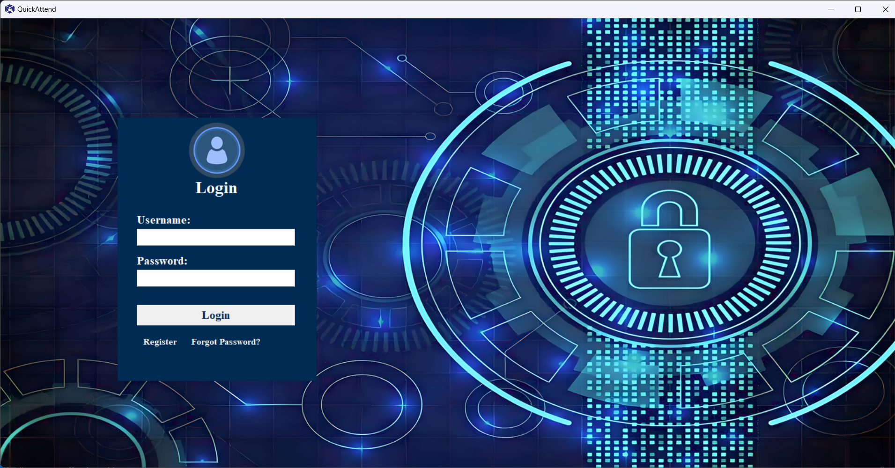
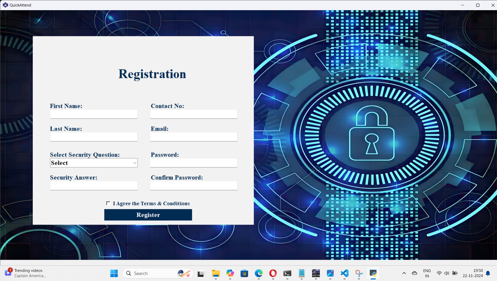
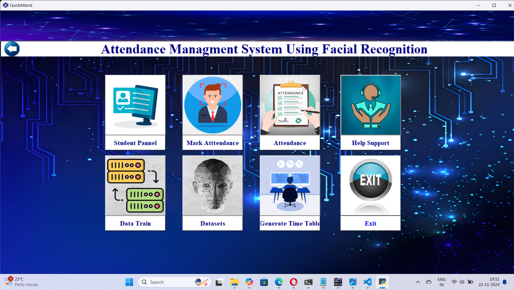
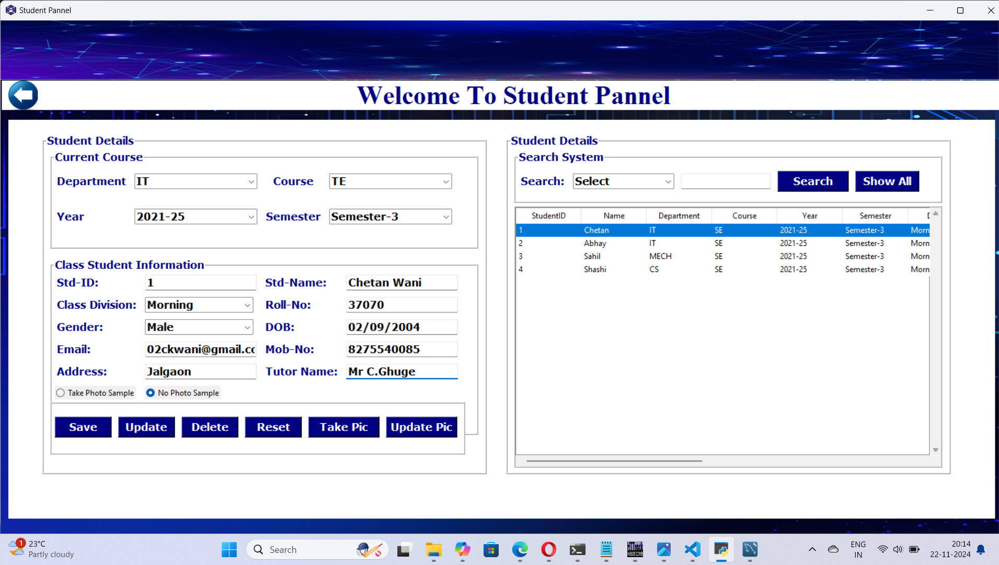
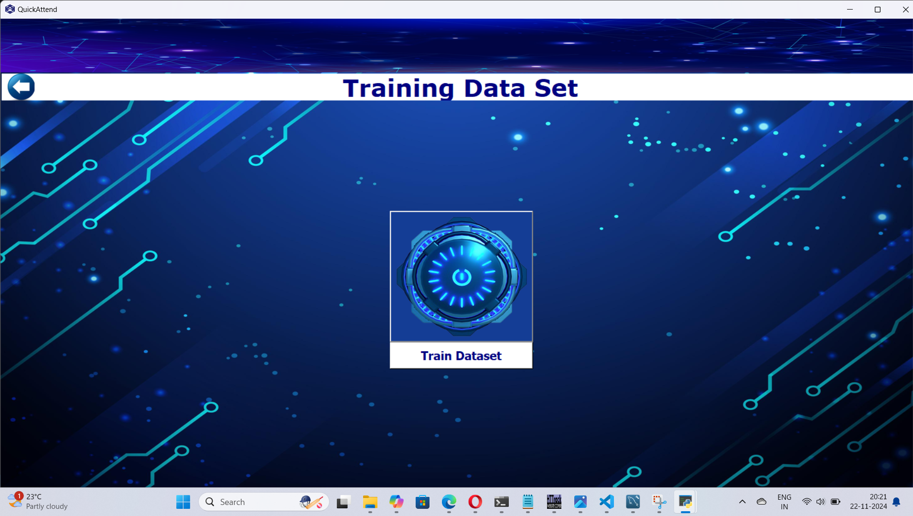
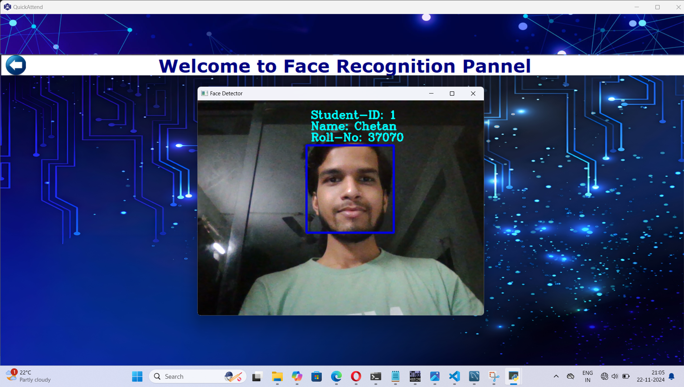
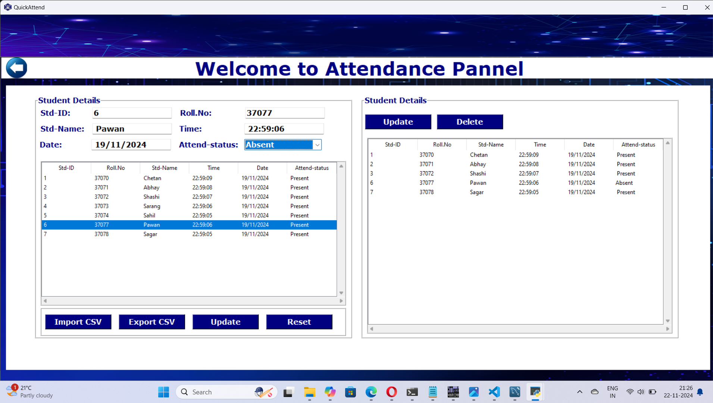

# Face Recognition-Based Attendance System

<div align="center">
  
</div>

## 🌟 About the Project

The **Face Recognition-Based Attendance System** is a Python-based project designed to automate the attendance process using facial recognition technology. It leverages powerful libraries and tools to ensure accuracy and efficiency.

---

## 📋 Features

- 📸 **Face Detection & Recognition**: Real-time recognition using OpenCV and trained models.
- 📅 **Attendance Management**: Records attendance in a structured database.
- 🔒 **Secure Storage**: Data stored securely in MySQL.
- 📊 **Analytics**: Provides attendance reports and insights.

---

## 🛠️ Technology Stack

- **Frontend**: Tkinter for GUI
- **Backend**: Flask (Optional for web access), OpenCV, MySQL
- **Database**: MySQL

---

## 🚀 How to Run the Project

### Prerequisites

1. Install Python (>= 3.7).
2. Install the required libraries by running:
   ```bash
   pip install -r requirements.txt
   
---

### Steps to Run

1. Clone the repository:
   ```bash
   git clone https://github.com/Wani-Chetan-999/FaceRecognitionAttendance.git

2. Navigate to the project directory:
   ```bash
   cd QuickAttend

3. Run the main Python script:
   ```bash
   python login.py

---

## Screenshots

Here are some screenshots of the system in action:

- **Login Screen**
<div align="center">
  
</div>

- **Registration Screen**
<div align="center">
  
</div>

- **Main Window**
<div align="center">
  
</div>

- **Student Registartion Pannel**
<div align="center">
  
</div>

- **Data Train Module**
<div align="center">
  
</div>

- **Face Detect & MArk Attendance**
<div align="center">
  
</div>

- **Attedance Module**
<div align="center">
  
</div>

### 📝 Usage

1. **Admin uploads user photos** to register faces in the system.
2. **Users log their attendance** by standing in front of the camera. The system will automatically detect and recognize their faces.
3. **Attendance records** are automatically stored in the database.
4. **Admin can view or export** attendance records as needed.

The system allows efficient and automatic attendance logging using face recognition, ensuring accuracy and ease of use.

---

### 🤝 Contributing

Contributions are welcome! If you'd like to contribute, please follow these steps:

1. **Fork the repository.**
2. **Create a new branch:**

   ```bash
   git checkout -b feature/YourFeature
3. **Commit your changes:**
   ```bash
   git commit -m 'Add some feature'
4. **Push to the branch:**
   ```bash
   git push origin feature/YourFeature
5. **Open a Pull Request**

---

### 📧 Contact

For any inquiries or support, feel free to reach out:

- **Name:** Chetan Wani
- **GitHub:** [Wani-Chetan-999](https://github.com/Wani-Chetan-999)
- **Contact:** 8275540085
- **Email:** [02ckwani@gmail.com](mailto:02ckwani@gmail.com)

<div align="center"> 
  <h4>⭐ Don't forget to star this repository if you found it useful! ⭐</h4> 
</div>
